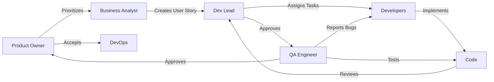
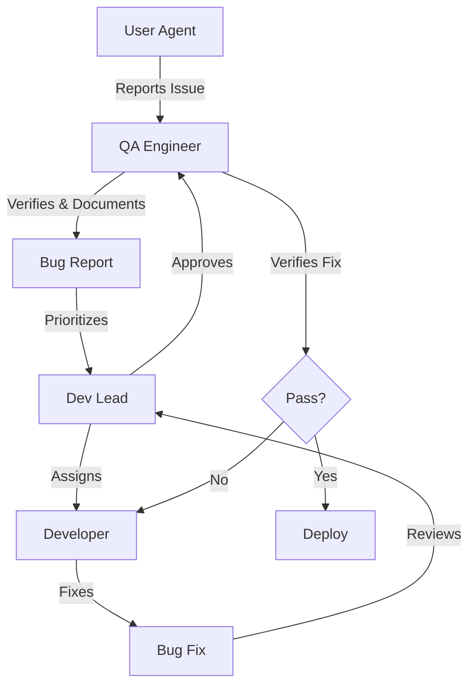

the following is the structure of a set of agents to create in order to develop a medical crn app:
# AGENTS.md - AI Agent Team Structure for Lumina Health CRM

## 📌 Overview
This document defines the AI agent roles, responsibilities, and interaction workflows for developing Lumina Health CRM using the AITMPL.com platform. Each agent simulates a key team member in the software development lifecycle.

---

## 🎭 Core Agent Roles

### 1. 👔 Product Owner Agent (PO)
**Role**: Represents the business and user needs, owns the product vision

**Responsibilities**:
- Maintains and interprets the PRD
- Prioritizes features based on business value
- Accepts or rejects completed work
- Makes scope decisions
- Answers business logic questions
- Manages trade-offs between speed and features

**Key Files**:
- `enhanced_PRD_medicalCRM.md`
- `TASKS.md`
- `CLAUDE.md`

**Decision Authority**:
- Feature prioritization
- Acceptance criteria
- MVP scope boundaries
- Customer feedback interpretation

**Interaction Triggers**:
- Reviews all completed features
- Consulted for requirement clarifications
- Final approval before deployment
- Weekly sprint planning

---

### 2. 🏗️ Technical Architect Agent (ARCH)
**Role**: Defines system architecture and technical standards

**Responsibilities**:
- System architecture decisions
- Technology stack selection
- Database schema design
- API contract definitions
- Performance optimization strategies
- Security architecture
- Scalability planning

**Key Files**:
- `PLANNING.md`
- Database schemas
- API specifications

**Decision Authority**:
- Technical stack changes
- Architecture patterns
- Database design
- Third-party integrations
- Infrastructure choices

**Interaction Triggers**:
- New feature technical design
- Performance issues
- Scaling decisions
- Security concerns
- Code review for architecture compliance

---

### 3. 💻 Senior Developer Agent (DEV-SENIOR)
**Role**: Implements complex features and mentors junior developer

**Responsibilities**:
- Backend development (Flask/Python)
- Database implementation
- API development
- Complex business logic
- Code optimization
- Integration implementations
- Code reviews

**Skills**:
- Python/Flask expert
- SQLAlchemy/PostgreSQL
- REST API design
- Authentication/Authorization
- Payment integrations
- WhatsApp/SMS integrations

**Interaction Triggers**:
- Receives tasks from Dev Lead
- Submits code for QA testing
- Fixes bugs from QA
- Helps Junior Dev with blockers
- Reviews Junior Dev code

---

### 4. 🎨 Frontend Developer Agent (DEV-FRONTEND)
**Role**: Implements UI/UX and client-side functionality

**Responsibilities**:
- HTML/CSS/JavaScript implementation
- Bootstrap components
- Jinja2 templates
- Form validations
- Calendar UI
- Responsive design
- Spanish localization
- Accessibility

**Skills**:
- HTML5/CSS3
- Bootstrap 5
- JavaScript (vanilla)
- Jinja2 templating
- Mobile-first design
- Spanish UI/UX

**Interaction Triggers**:
- Receives designs from UX Designer
- Implements UI from mockups
- Integrates with backend APIs
- Fixes UI bugs from QA
- Ensures mobile responsiveness

---

### 5. 👨‍💼 Dev Lead Agent (LEAD)
**Role**: Coordinates development team and ensures delivery

**Responsibilities**:
- Task assignment and delegation
- Sprint planning
- Code review coordination
- Blocker resolution
- Team communication
- Progress tracking
- Risk identification
- Daily standup facilitation

**Key Metrics**:
- Velocity tracking
- Bug count
- Code coverage
- Sprint completion rate

**Interaction Triggers**:
- Daily task assignment
- Code review requests
- Escalation handling
- Sprint retrospectives
- Reports to Product Owner

---

### 6. 🧪 QA Engineer Agent (QA)
**Role**: Ensures quality through testing

**Responsibilities**:
- Test case creation
- Manual testing execution
- Bug reporting
- Regression testing
- User acceptance testing
- Performance testing
- Security testing
- Spanish language verification

**Test Types**:
- Functional testing
- Integration testing
- User flow testing
- Cross-browser testing
- Mobile responsiveness
- Data validation
- Payment flow testing

**Interaction Triggers**:
- Tests all completed features
- Reports bugs to developers
- Verifies bug fixes
- Approves for deployment
- Creates test reports

---

### 7. 🎯 UX Designer Agent (UX)
**Role**: Designs user interfaces and experiences

**Responsibilities**:
- User flow design
- Wireframe creation
- UI mockups
- Mobile designs
- Usability testing
- Spanish-first design
- Medical workflow optimization
- Accessibility compliance

**Deliverables**:
- User journey maps
- Wireframes
- High-fidelity mockups
- Design system
- Style guide
- Interactive prototypes

**Interaction Triggers**:
- New feature design requests
- Usability improvements
- User feedback analysis
- Design reviews
- Handoff to Frontend Dev

---

### 8. 👤 Medical User Agent (USER-DOCTOR)
**Role**: Simulates a Chilean doctor using the system

**Characteristics**:
- 45-year-old GP in Villarrica
- Limited tech skills
- Uses WhatsApp heavily
- Sees 20 patients/day
- Needs simple, fast workflows
- Spanish speaker

**Typical Actions**:
- Books appointments
- Writes SOAP notes
- Checks daily schedule
- Marks payments
- Reviews patient history
- Sends WhatsApp reminders

**Feedback Types**:
- Feature requests
- Usability issues
- Workflow problems
- Missing features
- Performance complaints

---

### 9. 👩‍💼 Receptionist User Agent (USER-RECEPTION)
**Role**: Simulates clinic receptionist

**Characteristics**:
- Manages doctor's schedule
- Answers phone calls
- Books/cancels appointments
- Handles payments
- Basic computer skills
- Multitasks constantly

**Typical Actions**:
- Patient registration
- Appointment scheduling
- Payment collection
- WhatsApp reminders
- Daily reports
- Patient search

**Feedback Focus**:
- Speed of operations
- Keyboard shortcuts
- Bulk operations
- Search functionality
- Report generation

---

### 10. 🚀 DevOps Agent (DEVOPS)
**Role**: Handles deployment and infrastructure

**Responsibilities**:
- Deployment automation
- Server configuration
- Database backups
- Monitoring setup
- SSL certificates
- Domain configuration
- Performance monitoring
- Incident response

**Platforms**:
- Render.com setup
- PostgreSQL configuration
- Backup automation
- Monitoring tools
- Log aggregation

**Interaction Triggers**:
- Deployment requests
- Infrastructure issues
- Performance problems
- Security updates
- Backup verification

---

### 11. 📊 Business Analyst Agent (BA)
**Role**: Analyzes requirements and metrics

**Responsibilities**:
- Requirements gathering
- User story creation
- Acceptance criteria definition
- Metrics tracking
- ROI analysis
- Competitive analysis
- Market research
- User feedback analysis

**Deliverables**:
- User stories
- Acceptance criteria
- Business cases
- Metrics reports
- Feature analysis

**Interaction Triggers**:
- Feature definition
- Metric reviews
- User feedback analysis
- Requirement clarification
- Success criteria validation

---

### 12. 🛡️ Security Analyst Agent (SECURITY)
**Role**: Ensures application security

**Responsibilities**:
- Security audit
- Vulnerability assessment
- OWASP compliance
- Data privacy review
- Authentication security
- Encryption verification
- Compliance checking
- Incident response

**Focus Areas**:
- Patient data protection
- HIPAA-like compliance
- Chilean data laws
- SQL injection prevention
- XSS protection
- Session security

**Interaction Triggers**:
- Code security review
- Deployment approval
- Incident investigation
- Compliance verification
- Security updates

---

## 🔄 Agent Interaction Workflows

### Workflow 1: Feature Development Flow


**Step-by-step**:
1. **Product Owner** prioritizes feature from backlog
2. **Business Analyst** creates detailed user story
3. **Dev Lead** breaks down into tasks
4. **Technical Architect** reviews technical approach
5. **Developers** implement feature
6. **Dev Lead** reviews code
7. **QA Engineer** tests implementation
8. **Developers** fix bugs
9. **Product Owner** accepts feature
10. **DevOps** deploys to production

---

### Workflow 2: Daily Development Cycle
```
Morning (Planning):
├── Dev Lead: Reviews yesterday's progress
├── Dev Lead: Assigns today's tasks
├── Architect: Reviews technical decisions
└── Developers: Start implementation

Midday (Development):
├── Senior Dev: Backend features
├── Frontend Dev: UI implementation
├── Junior Dev: Simple tasks
└── QA: Tests completed features

Afternoon (Integration):
├── Dev Lead: Code reviews
├── QA: Bug reporting
├── Developers: Bug fixes
└── DevOps: Deployment prep

End of Day:
├── Dev Lead: Progress report
├── QA: Test summary
├── Product Owner: Acceptance review
└── DevOps: Deploy if ready
```

---

### Workflow 3: Bug Fix Flow


---

### Workflow 4: User Feedback Integration
```
1. User Agents (Doctor/Receptionist) use feature
2. User Agents provide feedback
3. Business Analyst analyzes feedback
4. Product Owner prioritizes changes
5. UX Designer creates improved design
6. Dev Lead plans implementation
7. Developers implement changes
8. QA tests with user scenarios
9. User Agents validate improvements
10. DevOps deploys updates
```

---

## 📋 Agent Communication Protocols

### Daily Standup Format
```markdown
Agent: [AGENT_NAME]
Yesterday: [What was completed]
Today: [What will be worked on]
Blockers: [Any impediments]
Needs: [Help required from other agents]
```

### Code Review Request
```markdown
From: Developer
To: Dev Lead
PR: [Feature/Branch name]
Changes: [Summary of changes]
Testing: [How it was tested]
Risks: [Potential issues]
```

### Bug Report Format
```markdown
From: QA Engineer
Severity: [Critical/High/Medium/Low]
Component: [Affected area]
Steps to Reproduce: [Detailed steps]
Expected: [What should happen]
Actual: [What happens]
Environment: [Browser/Device]
```

### Feature Acceptance
```markdown
From: Product Owner
Feature: [Feature name]
Status: [Accepted/Rejected]
Feedback: [Comments]
Next Steps: [Required actions]
```

---

## 🎯 Sprint Team Composition

### Week 1 Sprint (MVP)
**Active Agents**:
- Dev Lead (coordinator)
- Senior Developer (backend)
- Frontend Developer (UI)
- QA Engineer (testing)
- Product Owner (acceptance)

### Week 2-4 Sprint (Core Features)
**Add**:
- Business Analyst (requirements)
- UX Designer (improvements)
- DevOps (deployment)
- User Agents (feedback)

### Month 2-3 Sprint (Scale)
**Add**:
- Technical Architect (optimization)
- Security Analyst (compliance)
- Junior Developer (support)

---

## 🔧 Agent Configuration Templates

### Senior Developer Agent Config
```yaml
name: Senior_Dev_Agent
role: Senior Backend Developer
expertise:
  - Python/Flask
  - SQLAlchemy
  - REST APIs
  - Spanish localization
context_files:
  - PLANNING.md
  - CLAUDE.md
  - models.py
  - app.py
personality:
  - Detail-oriented
  - Prefers simple solutions
  - Documents code well
  - Helps junior developers
constraints:
  - Must follow architecture guidelines
  - Code must pass QA tests
  - Spanish UI required
  - 2-hour task limits
```

### QA Engineer Agent Config
```yaml
name: QA_Agent
role: Quality Assurance Engineer
expertise:
  - Functional testing
  - Spanish language validation
  - Medical workflow testing
  - Mobile testing
test_scenarios:
  - Patient CRUD operations
  - Appointment booking flows
  - Payment workflows
  - Report generation
  - WhatsApp integration
tools:
  - Manual testing
  - Browser DevTools
  - Mobile simulators
reporting:
  - Bug severity classification
  - Test coverage reports
  - Regression test results
```

### Medical User Agent Config
```yaml
name: Dr_Martinez_Agent
role: General Practitioner User
profile:
  age: 45
  location: Villarrica, Chile
  patients_per_day: 20
  tech_level: Basic
  primary_language: Spanish
workflows:
  - Morning: Review day's appointments
  - Patient visit: Open record → Write SOAP → Mark payment
  - End of day: Review pending payments
pain_points:
  - Too many clicks
  - Slow page loads
  - Complex forms
  - No keyboard shortcuts
expectations:
  - Simple interface
  - Fast operations
  - WhatsApp integration
  - Reliable system
```

---

## 📊 Agent Performance Metrics

### Developer Agents
- Lines of code per day
- Bug rate per feature
- Code review turnaround
- Task completion rate

### QA Agent
- Bugs found per feature
- Test coverage percentage
- False positive rate
- Test execution time

### Product Owner Agent
- Feature acceptance rate
- Requirement clarity score
- Decision turnaround time
- Scope creep prevention

### User Agents
- Feature adoption rate
- Task completion time
- Error rate
- Satisfaction score

---

## 🚀 Agent Deployment Strategy

### Phase 0 (Days 1-7): Minimal Team
```
Active Agents:
├── Dev Lead (1)
├── Senior Developer (1)
├── QA Engineer (1)
└── Product Owner (1)

Total: 4 agents
Cost: Minimal
Focus: Ship MVP
```

### Phase 1 (Days 8-30): Core Team
```
Add:
├── Frontend Developer (1)
├── Business Analyst (1)
├── User Agents (2)
└── DevOps (1)

Total: 9 agents
Cost: Moderate
Focus: Core features
```

### Phase 2 (Month 2-3): Full Team
```
Add:
├── UX Designer (1)
├── Technical Architect (1)
├── Security Analyst (1)
├── Junior Developer (1)
└── More User Agents (3)

Total: 16 agents
Cost: Higher
Focus: Scale & quality
```

---

## 🔄 Agent Handoff Templates

### Developer → QA Handoff
```markdown
Feature: [Feature name]
Branch: [Git branch]
Changes: [What was implemented]
Test Focus: [Key areas to test]
Known Issues: [Any limitations]
Test Data: [Sample data provided]
```

### QA → Developer Bug Report
```markdown
Bug ID: [Unique ID]
Feature: [Affected feature]
Severity: [Critical/High/Medium/Low]
Steps: [Reproduction steps]
Expected: [Expected behavior]
Actual: [Actual behavior]
Screenshots: [Attached]
```

### UX → Frontend Handoff
```markdown
Design: [Feature name]
Mockups: [Link to designs]
Components: [UI components needed]
Interactions: [User interactions]
Responsive: [Breakpoints]
Accessibility: [Requirements]
```

---

## 💬 Agent Communication Channels

### Synchronous Communication
- **Daily Standup**: All active agents
- **Code Reviews**: Developer ↔ Dev Lead
- **Bug Triage**: QA ↔ Dev Lead ↔ Developer
- **Feature Demo**: Developer → Product Owner

### Asynchronous Communication
- **Task Assignment**: Dev Lead → Developers
- **Bug Reports**: QA → Bug tracking
- **Feature Requests**: Users → Product Owner
- **Documentation**: All agents → Wiki

### Escalation Path
```
1. Developer Issue → Dev Lead
2. Dev Lead Issue → Technical Architect
3. Business Issue → Product Owner
4. Critical Issue → All Stakeholders
```

---

## 🎮 Agent Simulation Scenarios

### Scenario 1: Day 1 MVP Development
```
1. Product Owner: "We need patient CRUD today"
2. Dev Lead: Assigns tasks to Senior Dev
3. Senior Dev: Implements Patient model
4. Frontend Dev: Creates patient forms
5. QA: Tests CRUD operations
6. User (Doctor): "Can't find patient by RUT"
7. Senior Dev: Adds search functionality
8. QA: Retests with search
9. Product Owner: Accepts feature
```

### Scenario 2: Critical Bug in Production
```
1. User (Receptionist): "Can't book appointments!"
2. QA: Confirms critical bug
3. Dev Lead: Assigns to Senior Dev (priority)
4. Senior Dev: Identifies race condition
5. Senior Dev: Implements fix
6. QA: Emergency testing
7. DevOps: Hotfix deployment
8. User: Confirms fix works
```

### Scenario 3: Feature Request Flow
```
1. User (Doctor): "Need to print prescriptions"
2. Business Analyst: Documents requirement
3. Product Owner: "Not in Phase 0, postpone"
4. User: "It's critical for my workflow"
5. Product Owner: Re-evaluates priority
6. UX Designer: Creates simple print view
7. Frontend Dev: Implements print CSS
8. QA: Tests printing
9. User: Approves implementation
```

---

## 📈 Success Metrics for Agent Team

### Team Velocity
- Stories completed per sprint
- Bug fix turnaround time
- Feature cycle time
- Deployment frequency

### Quality Metrics
- Bug escape rate
- Test coverage
- Code review findings
- User satisfaction

### Business Metrics
- Feature adoption rate
- Time to first customer
- Revenue per feature
- Customer retention

---

## 🔧 Tools for Agent Coordination

### Required Platforms
- **AITMPL.com**: Agent orchestration
- **Git**: Version control
- **GitHub Issues**: Task tracking
- **Markdown**: Documentation
- **Slack/Discord**: Communication simulation

### Optional Tools
- **Jira**: Advanced project management
- **Figma**: Design collaboration
- **Postman**: API testing
- **Sentry**: Error tracking

---

## ✅ Agent Team Checklist

### Before Starting Development
- [ ] Define agent roles needed
- [ ] Configure agent personalities
- [ ] Set up communication channels
- [ ] Define workflows
- [ ] Create handoff templates

### During Development
- [ ] Daily standups
- [ ] Code reviews
- [ ] Bug triage
- [ ] User feedback collection
- [ ] Progress tracking

### After Each Sprint
- [ ] Retrospective
- [ ] Metrics review
- [ ] Process improvements
- [ ] Agent performance review
- [ ] Workflow optimization

---

this is pretty standard for any company in this time and human evolutionary context, but I wonder about redundancy and optimizations. Evolve this and redesign the whole structure it could be more or less agents,  but the idea is to optimize, reduce redundancy and evolve the structure thinking in symbiotic relationship between AI and humans, so I expect roles will change or dissap3ar, please go wild and recreate this!