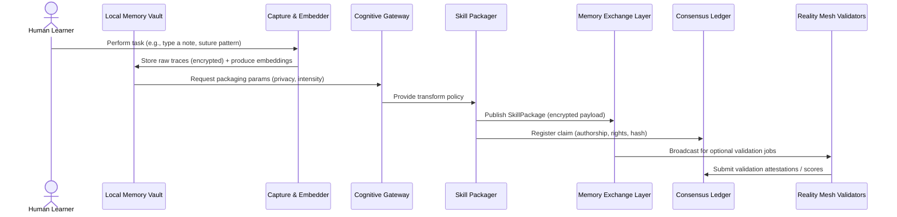
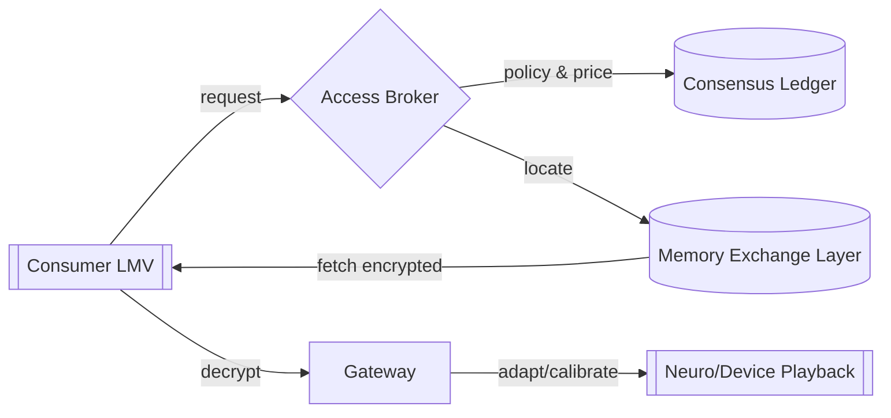

# 🧠 NeuroMemory MVP — Architecture & JSON Schema

A practical, buildable blueprint for a **skill-transfer protocol** (procedural memories) using a post-company, agentic ecosystem. Includes an architecture diagram and a JSON schema you can implement today.

---

## 1) System Architecture (Post-Company, Agentic)

### 1.1 Components

* **Local Memory Vault (LMV)**: User-owned secure store (device/edge) holding raw signals and private keys.
* **Capture & Embedder**: Records multi-modal signals (motion, EMG, cursor/keystrokes, speech), derives compact **skill embeddings**.
* **Cognitive Gateway**: Personal adapter that calibrates intensity, privacy masking, and fit-to-brain settings.
* **Skill Packager**: Wraps embeddings + metadata into **SkillPackages**; handles encryption and watermarking.
* **Memory Exchange Layer (MEL)**: Decentralized content-addressed distribution (IPFS/libp2p-like) with rate limits and access brokers.
* **Consensus Ledger**: Permissioned chain for claims: authorship, provenance, revocation, rights, zk-attestations.
* **Reality Mesh (Validators)**: Network of verifiers that run reproducible tests (can this package reproduce task metrics?).
* **Value Hive (Prioritizer)**: Agent that routes demand/supply and sets pricing, bounties, and curation weights.
* **Governance Oracles**: Encode policy constraints (jurisdiction, age, medical/legal limits); gate issuance and playback.
* **Observer/Telemetry**: Privacy-preserving metrics (on-device first); emits usefulness scores and drift alerts.

### 1.2 Data Flow (Happy Path)



### 1.3 Access & Playback



**Notes**

* All **personal raw traces** remain in LMV; MEL only sees encrypted packages.
* Ledger stores **minimal metadata + proofs**, never raw data.
* Validators can be DAO-like swarms that are compensated for useful attestations.

---

## 2) Security & Privacy Model (MVP)

* **Key Mgmt**: Per-user Ed25519 identity + XChaCha20-Poly1305 content encryption; optional hardware-backed keys.
* **Authorship & Integrity**: Content-addressed CID + creator signature; ledger pin of `(CID, signature, policyHash, zkProof)`.
* **Selective Disclosure**: Encrypt per-recipient with HPKE; support for time-bounded access tokens.
* **Provenance**: zk-proofs that *you generated* the skill without exposing raw traces.
* **Revocation**: Ledger entry marking package as revoked; brokers propagate deny-lists; clients respect revocation.
* **Right-to-Forget**: Tombstone on MEL + ledger revoke + key shredding (rendering payload undecipherable).

---

## 3) JSON Schema — Skill Transfer Protocol (Draft 2020-12)

**File**: `skill-package.schema.json`

```json
{
  "$schema": "https://json-schema.org/draft/2020-12/schema",
  "$id": "https://lumina.health/schemas/skill-package.schema.json",
  "title": "SkillPackage",
  "type": "object",
  "required": ["id", "version", "creator", "created_at", "content", "integrity", "policy"],
  "properties": {
    "id": {"type": "string", "format": "uuid"},
    "version": {"type": "string", "const": "1.0.0"},
    "creator": {
      "type": "object",
      "required": ["pubkey", "did"],
      "properties": {
        "did": {"type": "string", "description": "Decentralized identifier of creator"},
        "pubkey": {"type": "string", "description": "Base58/hex public key"},
        "attestations": {
          "type": "array",
          "items": {"$ref": "#/$defs/attestation"}
        }
      }
    },
    "created_at": {"type": "string", "format": "date-time"},
    "locale": {"type": "string", "default": "es-CL"},
    "taxonomy": {
      "type": "array",
      "items": {"type": "string"},
      "description": "Skill tags, e.g., 'clinical.note.typing', 'suture.basic'"
    },
    "content": {
      "type": "object",
      "required": ["embedding", "protocol", "modality"],
      "properties": {
        "protocol": {"type": "string", "enum": ["skill_v1"]},
        "modality": {"type": "array", "items": {"type": "string", "enum": ["motion", "emg", "cursor", "keystroke", "speech"]}},
        "embedding": {
          "$ref": "#/$defs/embedding",
          "description": "Compressed representation of the procedural memory"
        },
        "calibration": {
          "type": "object",
          "properties": {
            "sampling_rate": {"type": "number"},
            "device_profile": {"type": "string"},
            "latency_ms": {"type": "number"}
          }
        },
        "benchmarks": {
          "type": "array",
          "items": {"$ref": "#/$defs/benchmark"}
        }
      }
    },
    "integrity": {
      "type": "object",
      "required": ["cid", "hash", "signature"],
      "properties": {
        "cid": {"type": "string", "description": "Content ID (IPFS-like)"},
        "hash": {"type": "string", "description": "SHA-256 of encrypted payload"},
        "signature": {"type": "string", "description": "Creator signature over (cid||hash)"}
      }
    },
    "policy": {
      "type": "object",
      "required": ["access", "usage", "expiry"],
      "properties": {
        "access": {
          "type": "object",
          "properties": {
            "allowed_dids": {"type": "array", "items": {"type": "string"}},
            "jurisdictions": {"type": "array", "items": {"type": "string"}},
            "age_min": {"type": "integer", "minimum": 0}
          }
        },
        "usage": {
          "type": "object",
          "properties": {
            "commercial": {"type": "boolean", "default": false},
            "research": {"type": "boolean", "default": true},
            "derivatives_allowed": {"type": "boolean", "default": false},
            "max_playbacks": {"type": "integer", "minimum": 1}
          }
        },
        "expiry": {"type": "string", "format": "date-time"}
      }
    },
    "proofs": {
      "type": "array",
      "items": {"$ref": "#/$defs/proof"}
    },
    "validator_scores": {
      "type": "array",
      "items": {"$ref": "#/$defs/validator_score"}
    }
  },
  "$defs": {
    "embedding": {
      "type": "object",
      "required": ["shape", "dtype", "compression", "content"],
      "properties": {
        "shape": {"type": "array", "items": {"type": "integer"}},
        "dtype": {"type": "string", "enum": ["float16", "bfloat16", "int8"]},
        "compression": {"type": "string", "enum": ["zstd", "lz4", "none"]},
        "content": {"type": "string", "contentEncoding": "base64"}
      }
    },
    "benchmark": {
      "type": "object",
      "required": ["name", "metric", "value"],
      "properties": {
        "name": {"type": "string"},
        "metric": {"type": "string", "enum": ["wpm", "error_rate", "task_time_s", "precision_mm"]},
        "value": {"type": "number"},
        "context": {"type": "string"}
      }
    },
    "attestation": {
      "type": "object",
      "required": ["type", "issuer", "signature"],
      "properties": {
        "type": {"type": "string", "enum": ["institution", "peer", "device"]},
        "issuer": {"type": "string"},
        "signature": {"type": "string"},
        "statement": {"type": "string"}
      }
    },
    "proof": {
      "type": "object",
      "required": ["scheme", "payload"],
      "properties": {
        "scheme": {"type": "string", "enum": ["zk-SNARK", "zk-STARK", "TEE-remote-attest"]},
        "payload": {"type": "string", "contentEncoding": "base64"},
        "public_inputs": {"type": "array", "items": {"type": "string"}}
      }
    },
    "validator_score": {
      "type": "object",
      "required": ["validator_did", "score", "timestamp"],
      "properties": {
        "validator_did": {"type": "string"},
        "score": {"type": "number", "minimum": 0, "maximum": 1},
        "timestamp": {"type": "string", "format": "date-time"},
        "notes": {"type": "string"}
      }
    }
  }
}
```

---

## 4) Example Instance (Minimal)

```json
{
  "id": "3b9c2f64-7f7a-4b72-9e13-61f5a9c1c8a1",
  "version": "1.0.0",
  "creator": {
    "did": "did:key:z6MkjExample",
    "pubkey": "ed25519:AbCd...",
    "attestations": [
      {"type": "device", "issuer": "LMV-TEGRA-X1", "signature": "sig..."}
    ]
  },
  "created_at": "2025-09-01T12:00:00Z",
  "locale": "es-CL",
  "taxonomy": ["clinical.note.typing"],
  "content": {
    "protocol": "skill_v1",
    "modality": ["cursor", "keystroke"],
    "embedding": {
      "shape": [8192],
      "dtype": "int8",
      "compression": "zstd",
      "content": "K8Q...base64...=="
    },
    "calibration": {"sampling_rate": 120.0, "device_profile": "kbd-mx", "latency_ms": 8},
    "benchmarks": [
      {"name": "typing-speed", "metric": "wpm", "value": 82},
      {"name": "typo-rate", "metric": "error_rate", "value": 0.012}
    ]
  },
  "integrity": {
    "cid": "bafybeiexamplecid",
    "hash": "sha256:99c1...",
    "signature": "sig:ed25519:9ab..."
  },
  "policy": {
    "access": {"allowed_dids": ["did:key:z6MkRecipient"], "jurisdictions": ["CL"], "age_min": 18},
    "usage": {"commercial": false, "research": true, "derivatives_allowed": false, "max_playbacks": 20},
    "expiry": "2026-09-01T12:00:00Z"
  },
  "proofs": [
    {"scheme": "zk-SNARK", "payload": "AAECAwQ...==", "public_inputs": ["bafybeiexamplecid"]}
  ],
  "validator_scores": [
    {"validator_did": "did:org:validator-01", "score": 0.92, "timestamp": "2025-09-01T12:30:00Z", "notes": "Matches benchmark claims"}
  ]
}
```

---

## 5) MVP Build Notes

* **Orchestration**: CrewAI/AutoGen agents for Capture→Package→Publish→Validate; message bus via NATS.
* **Distribution**: IPFS + libp2p private network; pinning via regional nodes (Chile-first).
* **Ledger**: Hyperledger Fabric or Cosmos-SDK app-chain for low-latency permissioned writes.
* **Crypto**: libsodium (Ed25519, XChaCha20-Poly1305); HPKE for recipient encryption.
* **ZK**: Circom + snarkjs for simple provenance proofs (creator key owns device attest).
* **Client**: Rust + Tauri desktop LMV; optional Android LMV with Jetpack + Rust core.
* **Playback**: gRPC to effector devices (haptics/VR/assistive UIs), plus “ghost cursor/keystroke coach.”

---

## 6) Compliance Guards (Healthcare Context)

* **No PHI in MEL/ledger**; only encrypted payloads + minimal metadata.
* **Policy Oracle** blocks export outside allowed jurisdictions.
* **Audit Trails**: On-device sealed logs; shareable via consent package.
* **Emergency Brake**: Global revocation for a package class (e.g., miscalibrated motor packages).

---

### Next steps

* Generate validation tests for one target skill (e.g., EMR note-taking macro flow).
* Stand up a devnet (MEL + ledger), mint two DIDs, and complete an end-to-end publish → validate → playback cycle.
